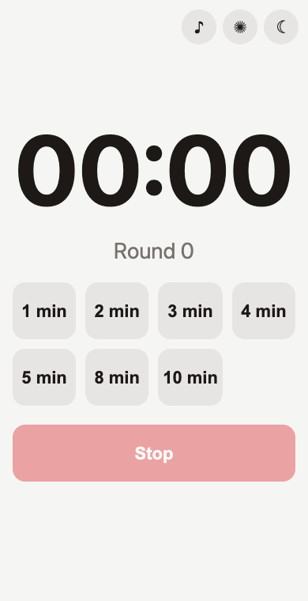
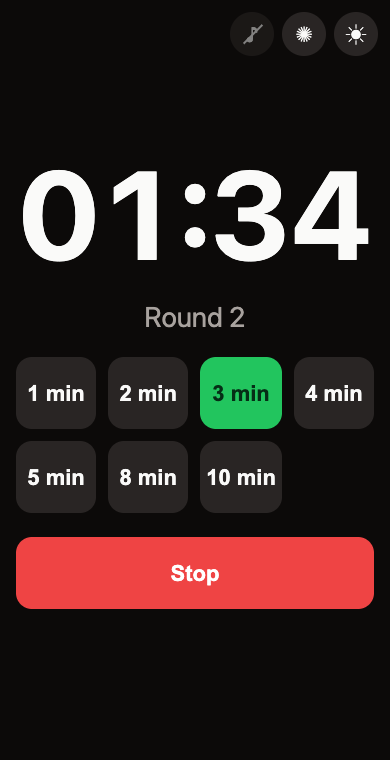

# Cycle Timer

A minimal repeating interval timer that runs in the browser. Pick a duration, and the timer counts it down, signals the end of the interval, and starts the next round right away, until you press **Stop**.

It fits anything done in equal rounds: EMOM workouts, circuit training, sparring rounds, rotating tasks, or timeboxed focus sessions.

**Live version:** https://navoznov.github.io/cycle-timer/

<p align="center">
  
  &nbsp;&nbsp;
  
</p>

## Features

- **Preset intervals:** 1, 2, 3, 4, 5, 8 and 10 minutes, one tap to start.
- **Endless rounds:** once an interval ends, the next one starts on its own. The round counter shows which round you're on.
- **End-of-interval signal:** three short beeps plus three flashes of the screen, so you notice it even when the sound is off or the room is loud. You can turn either signal off.
- **Screen stays on** while the page is open (via the [Screen Wake Lock API](https://developer.mozilla.org/en-US/docs/Web/API/Screen_Wake_Lock_API)).
- **Light and dark themes:** follows the system theme by default and can be switched by hand.
- **Remembers your settings:** theme and signal toggles are saved in `localStorage`.
- **Accurate timing:** time is calculated from the system clock, not by counting ticks, so the timer doesn't drift and catches up after the tab has been in the background.
- **Zero dependencies:** one HTML file with no build step, no frameworks, and no network requests.

## Getting Started

The fastest way is to open the [live version](https://navoznov.github.io/cycle-timer/). You don't need to install anything.

On a phone, add it to the home screen so it opens like an app:

- **iOS (Safari):** Share → *Add to Home Screen*.
- **Android (Chrome):** ⋮ menu → *Add to Home screen*.

## Usage

1. Tap one of the duration buttons, for example **3 min**. The countdown starts and the button turns green.
2. When the interval ends, you get the signal and the next round starts automatically.
3. Tap another duration at any time to restart with the new interval from round 1.
4. Tap **Stop** to reset the timer.

Controls in the top-right corner:

| Button | Action |
| ------ | ------ |
| ♪ | Turn the sound signal on or off |
| ✺ | Turn the screen flash on or off |
| ☾ / ☀ | Switch between the light and dark theme |

A crossed-out, dimmed button means that signal is off.

> Browsers only allow audio after a user gesture, so the sound is enabled the first time you tap a duration button.

## Installation

### Run locally

```bash
git clone https://github.com/navoznov/cycle-timer.git
cd cycle-timer
```

You can open `index.html` in a browser directly. To get the full feature set, use a local HTTP server instead, because some browsers only grant the wake lock on a secure context (`https://` or `localhost`):

```bash
python3 -m http.server 8000
# then open http://localhost:8000
```

Any other static server works as well (`npx serve`, `php -S localhost:8000`, etc.).

### Host your own copy

The app is plain static files, so any static hosting will do. The simplest option is GitHub Pages:

1. [Fork](https://github.com/navoznov/cycle-timer/fork) the repository.
2. In your fork, open **Settings → Pages**.
3. Under *Build and deployment*, choose **Deploy from a branch**, select `main` and `/ (root)`, then click **Save**.
4. After a minute the timer is live at `https://<your-username>.github.io/cycle-timer/`.

Netlify, Cloudflare Pages, Vercel and a plain nginx `root` also work: just serve the repository root.

## Customization

Everything lives in `index.html`:

- **Durations:** edit the `DURATIONS_MIN` array (values in minutes):
  ```js
  const DURATIONS_MIN = [1, 2, 3, 4, 5, 8, 10];
  ```
- **Sound:** `playSignal()` is the only place that defines the beep (frequency, count, length).
- **Flash:** `flashSignal()` controls how the screen blinks.
- **Colors:** CSS custom properties in `:root` for the light theme and in the `[data-theme="dark"]` / `prefers-color-scheme: dark` blocks for the dark theme.

## Project structure

```
.
├── index.html            # the whole app: markup, styles and script
├── favicon.svg           # browser tab icon
├── apple-touch-icon.png  # home screen icon for iOS
├── LICENSE               # MIT license
└── docs/screenshots/     # images used in this README
```

## Browser support

The app works in any modern browser (Chrome, Safari, Firefox, Edge), on desktop and mobile. Screen Wake Lock is supported in Chrome/Edge, in Safari 16.4+ and in Firefox 126+. Where it isn't available, the timer still works, but the screen may turn off according to your system settings.

## Contributing

Issues and pull requests are welcome. Keep changes in the spirit of the project: a single file, no dependencies, no build step.

1. Create a branch from `main`: `git checkout -b feature/my-change`.
2. Make your change and check it in a browser (light and dark theme, phone-sized screen).
3. Open a pull request against `main`.

## License

[MIT](LICENSE) © Ivan Navoznov
